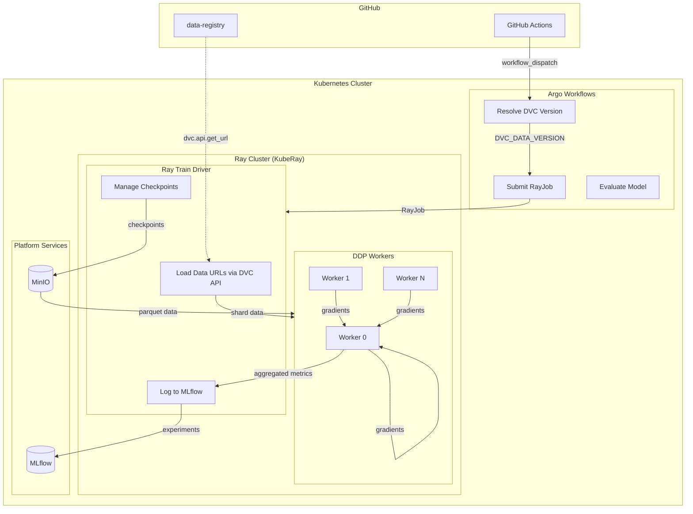
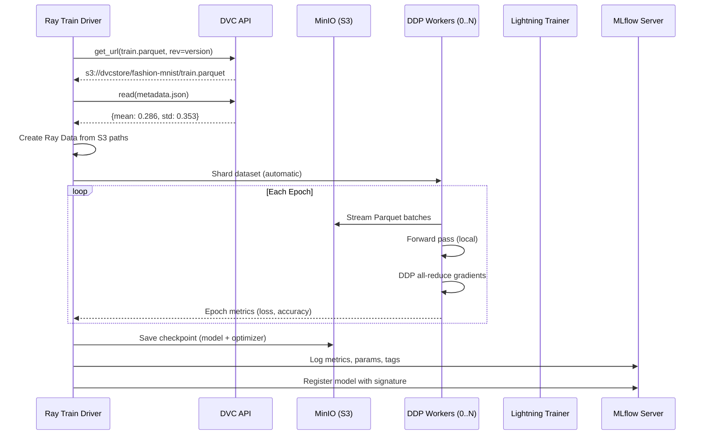
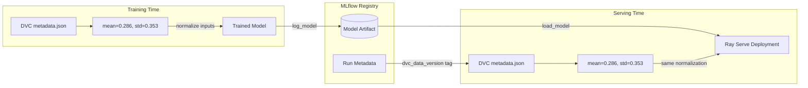

<a id="readme-top"></a>

<!-- PROJECT LOGO & TITLE -->

<div align="center">
  <a href="https://github.com/opencloudhub">
  <picture>
    <source media="(prefers-color-scheme: light)" srcset="https://raw.githubusercontent.com/opencloudhub/.github/main/assets/brand/assets/logos/primary-logo-light.svg">
    <source media="(prefers-color-scheme: dark)" srcset="https://raw.githubusercontent.com/opencloudhub/.github/main/assets/brand/assets/logos/primary-logo-dark.svg">
    <!-- Fallback -->
    
  </picture>
  </a>

<h1 align="center">Fashion MNIST — Distributed Training Demo</h1>

<p align="center">
    Distributed deep learning with Ray Train, PyTorch Lightning, and DDP — demonstrating scalable training patterns with MLflow tracking and Ray Serve deployment.<br />
    <a href="https://github.com/opencloudhub"><strong>Explore OpenCloudHub »</strong></a>
  </p>
</div>

______________________________________________________________________

<details>
  <summary>📑 Table of Contents</summary>
  <ol>
    <li><a href="#about">About</a></li>
    <li><a href="#thesis-context">Thesis Context</a></li>
    <li><a href="#architecture">Architecture</a></li>
    <li><a href="#code-structure">Code Structure</a></li>
    <li><a href="#getting-started">Getting Started</a></li>
    <li><a href="#infrastructure">Infrastructure Options</a></li>
    <li><a href="#usage">Usage</a></li>
    <li><a href="#configuration">Configuration</a></li>
    <li><a href="#workflow-tags">Workflow Tags & Traceability</a></li>
    <li><a href="#contributing">Contributing</a></li>
    <li><a href="#license">License</a></li>
  </ol>
</details>

______________________________________________________________________

<h2 id="about">🎯 About</h2>

This repository demonstrates **distributed deep learning** using PyTorch Lightning and the Fashion MNIST dataset. While the model itself remains simple (ResNet18), the focus is on scalable training infrastructure that can handle larger workloads.

The pipeline demonstrates:

- **Distributed Data Parallel (DDP)** — Ray Train orchestrates multi-worker training with automatic gradient synchronization
- **Ray Data Integration** — Parquet files streamed directly from S3, sharded across workers without full dataset materialization
- **PyTorch Lightning + Ray** — Lightning's structured training loop running inside Ray Train's distributed context
- **Checkpoint Management** — Fault-tolerant training with S3-backed checkpoints
- **Training-Serving Consistency** — Normalization parameters stored in DVC metadata, fetched by both training and serving

______________________________________________________________________

<h2 id="thesis-context">📚 Thesis Context</h2>

This repository is part of a Master's thesis: **"A Scalable MLOps System for Multimodal Educational Analysis"** at Goethe University Frankfurt / DIPF Leibniz Institute.

### Role in the Platform

This workload introduces **distributed training** to the platform demonstration. Building on the patterns established in [ai-ml-sklearn](https://github.com/opencloudhub/ai-ml-sklearn), it validates that the infrastructure scales beyond single-node training while maintaining full traceability and reproducibility.

The Fashion MNIST dataset and ResNet18 model are intentionally simple — the complexity lies in the distributed training orchestration, not the model architecture. This separation allows clear demonstration of infrastructure patterns without GPU requirements for basic testing.

### Requirements Addressed

| Req ID   | Requirement            | Implementation                                                          |
| -------- | ---------------------- | ----------------------------------------------------------------------- |
| **FR1**  | Experiment Tracking    | MLflow logging from Ray Train driver; metrics aggregated across workers |
| **FR2**  | Data Versioning        | DVC-versioned Parquet files; normalization params in `metadata.json`    |
| **FR3**  | Model Registry         | PyTorch Lightning checkpoint converted and registered in MLflow         |
| **FR5**  | Model Serving          | Ray Serve loads model + fetches matching normalization params from DVC  |
| **FR6**  | Framework Agnosticism  | Validates platform supports PyTorch/Lightning alongside sklearn         |
| **FR7**  | Distributed Training   | Ray Train with `TorchTrainer`, DDP strategy, multi-worker execution     |
| **FR14** | GitOps Deployment      | RayService manifests synced by ArgoCD                                   |
| **FR15** | CI/CD Integration      | GitHub Actions → Argo Workflows → RayJob                                |
| **NFR1** | End-to-End Lineage     | Workflow tags on MLflow runs; DVC version tracked through serving       |
| **NFR2** | Reproducibility        | Checkpoints in S3; deterministic data sharding via Ray Data             |
| **NFR3** | Horizontal Scalability | Worker count configurable; data automatically sharded                   |
| **C1**   | Open-Source Only       | PyTorch, Lightning, Ray, MLflow — all permissive licenses               |

### Key Differentiators from Baseline

| Aspect        | ai-ml-sklearn (Baseline)    | ai-dl-lightning (This Repo)          |
| ------------- | --------------------------- | ------------------------------------ |
| Training      | Single-node, joblib backend | Distributed DDP across workers       |
| Data Loading  | pandas DataFrame            | Ray Data streaming from S3           |
| Framework     | scikit-learn Pipeline       | PyTorch Lightning Module             |
| Checkpointing | None (fast training)        | S3-backed for fault tolerance        |
| Preprocessing | Fitted at training time     | Pre-computed, stored in DVC metadata |

### Integration Patterns Demonstrated

```
┌─────────────────┐     ┌───────────────────┐     ┌─────────────────┐
│  data-registry  │────▶│  ai-dl-lightning  │────▶│     gitops      │
│                 │     │   (this repo)     │     │                 │
│  - train.parquet│     │                   │     │  - RayService   │
│  - val.parquet  │     │  Ray Train Driver │     │    manifest     │
│  - metadata.json│     │  ┌─────┬─────┐    │     │                 │
│    (mean, std)  │     │  │ W0  │ W1  │... │     │  - ArgoCD sync  │
└─────────────────┘     │  └─────┴─────┘    │     └─────────────────┘
                        └───────────────────┘
```

### Related Components

| Component                | Repository                                                     | Relationship                                         |
| ------------------------ | -------------------------------------------------------------- | ---------------------------------------------------- |
| **Data Source**          | [data-registry](https://github.com/opencloudhub/data-registry) | DVC-versioned Fashion MNIST (Parquet + metadata)     |
| **Workflow Templates**   | [gitops](https://github.com/opencloudhub/gitops)               | Argo Workflow templates with RayJob submission       |
| **Deployment Manifests** | [gitops](https://github.com/opencloudhub/gitops)               | RayService YAML for model serving                    |
| **CI/CD Actions**        | [.github](https://github.com/opencloudhub/.github)             | Reusable workflows for Docker builds, DVC resolution |

______________________________________________________________________

<h2 id="architecture">🏗️ Architecture</h2>

### Distributed Training Architecture



### Ray Train + Lightning Integration



### Training-Serving Consistency



The serving layer extracts `dvc_data_version` from the MLflow run metadata and fetches normalization parameters from the same DVC version used during training. This guarantees that inference uses identical preprocessing.

______________________________________________________________________

<h2 id="code-structure">📂 Code Structure</h2>

Each file includes detailed header comments explaining its purpose and integration points.

### Project Layout

```
ai-dl-lightning/
├── src/
│   ├── training/                   # Distributed training pipeline
│   │   ├── train.py                # Ray Train driver + MLflow logging
│   │   ├── model.py                # PyTorch Lightning module (ResNet18)
│   │   ├── data.py                 # Ray Data loading from DVC/S3
│   │   └── config.py               # Pydantic configuration
│   ├── serving/                    # Model serving
│   │   ├── serve.py                # Ray Serve + FastAPI deployment
│   │   ├── schemas.py              # Request/response models
│   │   └── config.py               # Serving configuration
│   └── _utils/
│       └── logging.py              # Rich logging utilities
├── tests/
│   └── test_mnist_classifier.py    # API integration tests
├── .github/workflows/
│   ├── ci-code-quality.yaml        # Linting, type checks
│   ├── ci-docker-build-push.yaml   # Multi-stage Docker builds
│   └── train.yaml                  # MLOps pipeline trigger
├── Dockerfile                      # Multi-stage: training + serving
├── .env.docker                     # Local compose environment
├── .env.minikube                   # Minikube environment
└── pyproject.toml                  # UV package configuration
```

### Training Module (`src/training/`)

#### `train.py` — Ray Train Driver

The main training script orchestrates distributed training:

```python
# Key responsibilities:
# 1. Parse CLI arguments (--lr, --batch-size, --max-epochs, --num-workers)
# 2. Load data URLs and normalization params via DVC
# 3. Configure TorchTrainer with DDP strategy
# 4. Execute distributed training across Ray workers
# 5. Log aggregated metrics to MLflow (from driver only)
# 6. Save checkpoints to S3 and register model
```

**Ray Train Configuration:**

```python
trainer = TorchTrainer(
    train_loop_per_worker=train_func,  # Runs on each worker
    train_loop_config={...},  # Hyperparameters
    scaling_config=ScalingConfig(
        num_workers=num_workers,  # DDP worker count
        use_gpu=use_gpu,
    ),
    run_config=RunConfig(
        storage_path=f"s3://{bucket}/{path}",  # S3 for distributed checkpoints
        checkpoint_config=CheckpointConfig(...),
    ),
)
```

**MLflow Integration Pattern:**

```python
# MLflow logging happens ONLY on the driver (rank 0 equivalent)
# Workers compute gradients; driver aggregates and logs
with mlflow.start_run():
    mlflow.set_tags(WORKFLOW_TAGS.model_dump())  # Traceability
    result = trainer.fit()  # Distributed training
    mlflow.log_metrics(result.metrics)  # Aggregated metrics
    mlflow.pytorch.log_model(model, ...)  # Register model
```

#### `model.py` — PyTorch Lightning Module

Defines the ResNet18-based classifier:

```python
# FashionMNISTClassifier(LightningModule):
#
# Architecture:
#   - ResNet18 backbone (pretrained=False for grayscale)
#   - Modified first conv: 1 channel instead of 3
#   - 10-class output (Fashion MNIST categories)
#
# Lightning hooks:
#   - training_step(): Forward + loss + logging
#   - validation_step(): Metrics without gradient
#   - configure_optimizers(): Adam with configurable LR
#
# Ray Train integration:
#   - Metrics reported via self.log() → aggregated by Ray
#   - Checkpointing handled by Ray Train, not Lightning
```

#### `data.py` — Ray Data Loading

Handles distributed data loading from DVC-versioned sources:

```python
# Key functions:
#
# get_data_paths(version: str) -> Tuple[str, str, dict]:
#     - Resolves DVC version to S3 URLs for train/val Parquet
#     - Fetches metadata.json with normalization params
#     - Returns (train_url, val_url, metadata)
#
# create_ray_datasets(train_url, val_url) -> Tuple[Dataset, Dataset]:
#     - Creates Ray Data datasets from S3 Parquet files
#     - Data is NOT materialized — streamed during training
#     - Automatic sharding across workers
```

**Why Ray Data instead of PyTorch DataLoader:**

```python
# Traditional approach (doesn't scale):
# - Each worker loads entire dataset into memory
# - Data copied N times for N workers

# Ray Data approach (scales):
# - Dataset defined as reference to S3 paths
# - Ray automatically shards across workers
# - Each worker streams only its shard
# - No full materialization required
```

**Normalization Pattern:**

```python
# metadata.json (in DVC):
{"normalization": {"mean": 0.28604060411453247, "std": 0.3530242443084717}}

# Training: Applied in data preprocessing
# Serving: Fetched from same DVC version via run metadata
```

#### `config.py` — Configuration Management

```python
# TrainingConfig:
#   - mlflow_experiment_name: str
#   - mlflow_registered_model_name: str
#   - ray_storage_endpoint: str (MinIO URL)
#   - ray_storage_path: str (S3 bucket path)
#   - ray_num_workers: int (default DDP workers)
#   - dvc_repo: str (data-registry URL)
#
# WorkflowTags:
#   - argo_workflow_uid: str
#   - docker_image_tag: str
#   - dvc_data_version: str
```

### Serving Module (`src/serving/`)

#### `serve.py` — Ray Serve Deployment

Production serving with normalization consistency:

```python
# FashionMNISTDeployment:
#
# __init__(model_uri: str):
#     1. Load model from MLflow registry
#     2. Extract dvc_data_version from run tags
#     3. Fetch normalization params from DVC (same version!)
#     4. Store mean/std for inference preprocessing
#
# predict(images: List[np.ndarray]) -> List[int]:
#     1. Normalize using stored mean/std
#     2. Convert to tensor, add batch dimension
#     3. Forward pass through model
#     4. Return predicted class indices
```

**Hot Reload for Model Updates:**

```python
def reconfigure(self, config: Dict):
    """Zero-downtime model update."""
    new_uri = config.get("model_uri")
    if new_uri != self.model_uri:
        self.model = mlflow.pytorch.load_model(new_uri)
        # Re-fetch normalization for new model's data version
        self._load_normalization_params()
```

### CI/CD Workflows

#### `train.yaml` — MLOps Pipeline

```yaml
# Workflow dispatch inputs:
#   - dvc_data_version: Dataset version (e.g., fashion-mnist-v1.0.0)
#   - num_workers: DDP worker count
#   - compute_type: CPU or GPU configuration
#
# Calls reusable workflow that:
#   1. Resolves Docker image SHA
#   2. Submits Argo Workflow with RayJob
#   3. RayJob executes distributed training
```

______________________________________________________________________

<h2 id="getting-started">🚀 Getting Started</h2>

### Prerequisites

- Docker
- VS Code with DevContainers extension (recommended)

### Setup

1. **Clone the repository**

   ```bash
   git clone https://github.com/opencloudhub/ai-dl-lightning.git
   cd ai-dl-lightning
   ```

1. **Open in DevContainer** (Recommended)

   VSCode: `Ctrl+Shift+P` → `Dev Containers: Rebuild and Reopen in Container`

   Or **setup locally**:

   ```bash
   curl -LsSf https://astral.sh/uv/install.sh | sh
   uv sync --dev
   ```

1. **Choose infrastructure backend** (see next section)

______________________________________________________________________

<h2 id="infrastructure">🛠️ Infrastructure Options</h2>

### Option 1: Local Compose Stack

For quick iterations without Kubernetes. Provides MLflow and MinIO via Docker Compose.

```bash
# Start MLflow + MinIO
git clone https://github.com/OpenCloudHub/local-compose-stack.git
cd local-compose-stack && docker compose up -d

# Configure and run
cd ../ai-dl-lightning
set -a && source .env.docker && set +a
ray start --head --num-cpus 8
```

**Available Services:**

| Service       | URL                   |
| ------------- | --------------------- |
| MLflow UI     | http://localhost:5000 |
| MinIO Console | http://localhost:9001 |
| Ray Dashboard | http://localhost:8265 |

### Option 2: Local Development with Minikube Backend

Run training scripts locally while using platform services deployed on Minikube. Useful for testing distributed training patterns without cluster job submission.

```bash
set -a && source .env.minikube && set +a
ray start --head --num-cpus 8

# Run distributed training locally (2 workers)
python src/training/train.py --num-workers 2 --max-epochs 5

python src/training/train.py --num-workers 2 --gpu-per-worker 0.3
```

Requires the OpenCloudHub platform deployed via the [gitops](https://github.com/opencloudhub/gitops) repository.

### Option 3: Full Cluster Execution

Training runs as a RayJob on Kubernetes, triggered via CI/CD. This is the production pattern demonstrating true distributed training across cluster nodes.

**Trigger training:** [Actions → MLOps Pipeline](https://github.com/OpenCloudHub/ai-dl-lightning/actions/workflows/train.yaml)

**Flow:** GitHub Actions → Argo Workflows → RayJob (distributed training) → MLflow Registry → RayService (serving)

______________________________________________________________________

<h2 id="usage">📖 Usage</h2>

### Training

```bash
# Single worker (development)
python src/training/train.py --max-epochs 5 --lr 0.001

# Multi-worker DDP (Distributed Data Parallel) on sharded GPU
python src/training/train.py --num-workers 2 --gpu-per-worker 0.3 --max-epochs 10 --batch-size 128

# Via Ray Job API (production-like)
RAY_ADDRESS='http://127.0.0.1:8265' ray job submit --working-dir . -- \
    python src/training/train.py --num-workers 2 --max-epochs 10
```

**CLI Arguments:**

| Argument           | Default        | Description           |
| ------------------ | -------------- | --------------------- |
| `--run-name`       | auto-generated | MLflow run name       |
| `--batch-size`     | `128`          | Per-worker batch size |
| `--lr`             | `0.001`        | Learning rate         |
| `--max-epochs`     | `2`            | Training epochs       |
| `--num-workers`    | from config    | Number of DDP workers |
| `--gpu-per-worker` | from config    | Number of DDP workers |

### Serving

```bash
# Development with hot-reload
serve run src.serving.serve:app_builder model_uri="models:/ci.fashion-mnist-classifier/1" --reload

# Access API docs
open http://localhost:8000/docs
```

**Endpoints:**

| Endpoint   | Method | Description                                               |
| ---------- | ------ | --------------------------------------------------------- |
| `/`        | GET    | Service info                                              |
| `/health`  | GET    | Liveness probe                                            |
| `/info`    | GET    | Model metadata (URI, run_id, data_version, normalization) |
| `/predict` | POST   | Batch image predictions                                   |

______________________________________________________________________

<h2 id="configuration">⚙️ Configuration</h2>

### Required Environment Variables

| Variable                | Description                    | Local Value             |
| ----------------------- | ------------------------------ | ----------------------- |
| `MLFLOW_TRACKING_URI`   | MLflow server URL              | `http://localhost:5000` |
| `RAY_STORAGE_ENDPOINT`  | MinIO endpoint for checkpoints | `localhost:9000`        |
| `RAY_STORAGE_PATH`      | S3 path for checkpoints        | `ray-results`           |
| `ARGO_WORKFLOW_UID`     | Workflow identifier            | `DEV`                   |
| `DOCKER_IMAGE_TAG`      | Image tag for traceability     | `DEV`                   |
| `DVC_DATA_VERSION`      | Dataset version                | `fashion-mnist-v1.0.0`  |
| `AWS_ACCESS_KEY_ID`     | MinIO access key               | from `.env.*`           |
| `AWS_SECRET_ACCESS_KEY` | MinIO secret                   | from `.env.*`           |

### Configuration Files

- **`.env.docker`** — Local compose stack settings
- **`.env.minikube`** — Minikube/Kubernetes settings
- **`src/training/config.py`** — Training defaults (Ray workers, S3 paths, DVC config)
- **`src/serving/config.py`** — Serving limits (max batch size)

______________________________________________________________________

<h2 id="workflow-tags">🏷️ Workflow Tags & Traceability</h2>

Every training run is tagged with identifiers enabling complete traceability:

| Tag                 | Source                  | Purpose                           |
| ------------------- | ----------------------- | --------------------------------- |
| `argo_workflow_uid` | `ARGO_WORKFLOW_UID` env | Links to Argo Workflows execution |
| `docker_image_tag`  | `DOCKER_IMAGE_TAG` env  | Identifies exact code version     |
| `dvc_data_version`  | `DVC_DATA_VERSION` env  | Identifies dataset version        |

**Extended Traceability (beyond baseline):**

```
MLflow Run
    ├── argo_workflow_uid ──────► Argo Workflows UI
    ├── docker_image_tag ───────► Container Registry
    ├── dvc_data_version ───────► data-registry Git tag
    │   └── metadata.json ──────► Normalization params (mean, std)
    ├── ray_job_id ─────────────► Ray Dashboard (worker logs)
    └── checkpoint_path ────────► S3 checkpoint location
```

**Serving uses these tags** to fetch the correct normalization parameters, ensuring training-serving consistency.

______________________________________________________________________

<h2 id="contributing">👥 Contributing</h2>

Contributions welcome! See [Contributing Guidelines](https://github.com/opencloudhub/.github/blob/main/.github/CONTRIBUTING.md) and [Code of Conduct](https://github.com/opencloudhub/.github/blob/main/.github/CODE_OF_CONDUCT.md).

______________________________________________________________________

<h2 id="license">📄 License</h2>

Apache 2.0 License. See [LICENSE](LICENSE).

______________________________________________________________________

<h2 id="acknowledgements">🙏 Acknowledgements</h2>

- [PyTorch Lightning](https://lightning.ai/) — Structured deep learning training
- [Ray Train](https://docs.ray.io/en/latest/train/train.html) — Distributed training orchestration
- [Ray Data](https://docs.ray.io/en/latest/data/data.html) — Scalable data loading
- [MLflow](https://mlflow.org/) — Experiment tracking and model registry
- [DVC](https://dvc.org/) — Data version control
- [Fashion MNIST](https://github.com/zalandoresearch/fashion-mnist) — Dataset by Zalando Research

<p align="right">(<a href="#readme-top">back to top</a>)</p>
